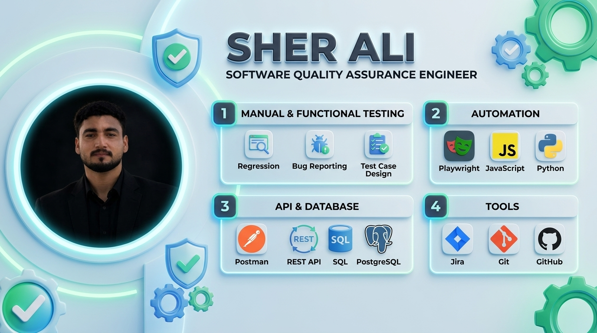

  <!-- 3D ALL-IN-ONE MASTER BANNER -->
  

    

  <!-- Dynamic Typing Title -->
  

   

  <!-- Profile Metrics -->
  

    
    &nbsp;
    
    &nbsp;
    
  

  <!-- Direct Contact Buttons -->
  

    
    &nbsp;
    
    &nbsp;
    
  

---

### 👨‍💻 About Me

Passionate and detail-driven **Software Quality Assurance Engineer** dedicated to delivering reliable, bug-free, and high-performance software. Experienced in designing comprehensive test cases, executing end-to-end API validations, building automated testing scripts with **Playwright**, and verifying backend databases using **SQL & PostgreSQL**.

- 🔭 **Current Focus:** E2E Automation with Playwright & Automated Quality Pipelines.
- 🎯 **Core Expertise:** Functional Testing, Regression Suites, Bug Lifecycle Management, API Testing.
- 💬 **Ask Me About:** Manual Testing, Postman, Playwright Automation, SQL Queries, and Defect Reporting.
- ⚡ **Philosophy:** *"Quality is not an act, it is a habit. Finding bugs before your users do!"*

---

### 🧪 QA Engineering Lifecycle
